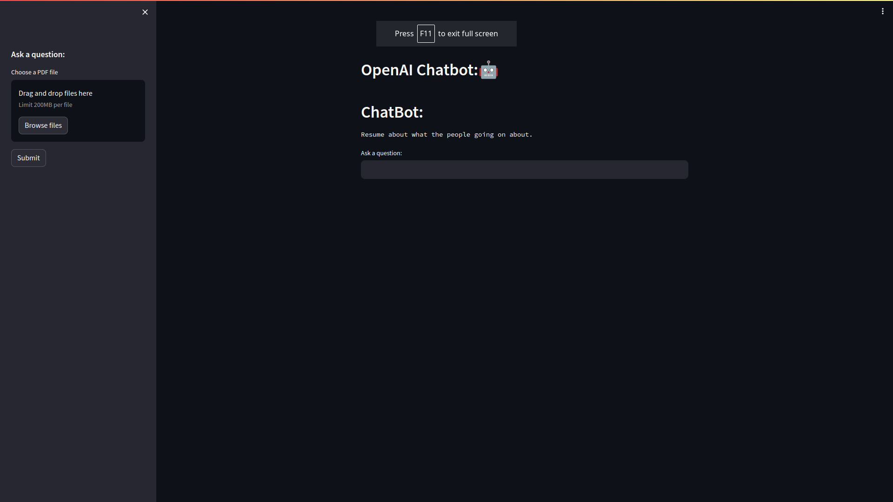
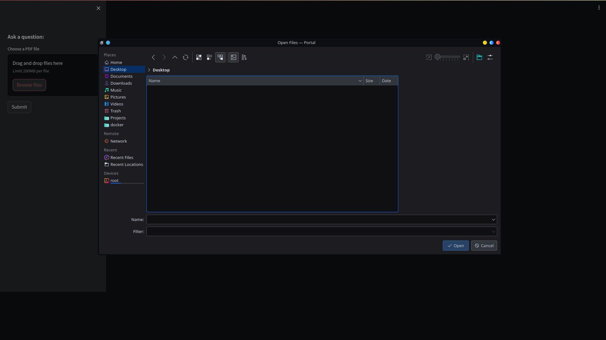
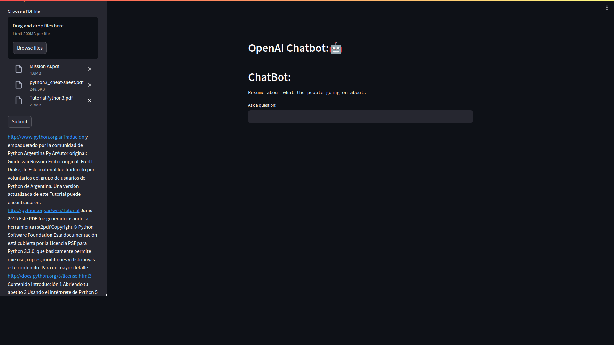

# Interact with PDF documentation embedded with GPT4 through Chat created in Streamlit.





> The provided code essentially implements a chatbot using the streamlit library. The chatbot interacts with the user through a web interface and can process PDF files sent by the user.


## 💻 Pre-requirements

Before starting, verify that you meet the following requirements:

- Create the virtual environment with poetry from version 1.7.0, activate the virtual environment and ready to install the requirements.

- This can be run from any operating system but in my case I use Linux with "Python" version 3.9.0.
  
## 🚀 installing chat_pdfload_embedding_gpt4_streamlit

- To install or chat_pdfload_embedding_gpt4_streamlit, have to install the requirements you can use, within the virtual environment active, follow these steps:


```
poetry install or pip install -r requirements.txt
```

- After this you need to generate an .env file with these characteristics to be able to place your OpenAI KEY.

```
OPENAI_API_KEY = ""
```

## ☕ Using chat_pdfload_embedding_gpt4_streamlit

- To use chat_pdfload_embedding_gpt4_streamlit, follow these steps:

```
streamlit run streamlit_app.py 
```

- When you run this command in your code editor's terminal it returns the project running from these links:

```
 Local URL: http://localhost:8501
 Network URL: http://10.0.0.140:8501
```

## 🤖 Ways to use or interact with the chat_pdfload_embedding_gpt4_streamlit

- Search from the browser files button for the documentation you want to consult and execute submit, this takes a few seconds depending on the number of documents uploaded and their weights.



- Gives the opportunity to upload several PDF files at the same time and shows a sample of the contents of the documents when I finish uploading.




- Regarding that inserted documentation, you can ask all the questions you need to the chat, until a summary is generated; specific data only exists in those documents.


I invite you to try it and if you want to contribute, please do not hesitate to leave an issue with your suggestions and contact me privately.

# 📝 Licença

This project is under license. See the file [LICENCE](LICENSE.md) for more details.